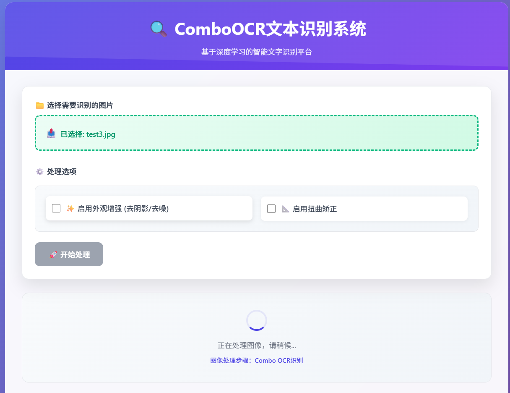

# ComboOCR - 智能文本识别系统
<div align="center">
    
</div>

  

**基于深度学习的高精度OCR文本识别系统**

## 📖 项目简介

ComboOCR是一个高精度的OCR文本识别系统，集成了多种先进的深度学习模型：

- **PPOCRv5微调模型**: 基于PPOCRv5的检测、识别和文字方向分类模型
- **外观增强模型**: 去除阴影、噪音，提升图像质量
- **扭曲矫正模型**: 自动矫正文档扭曲变形

## 🚀 快速开始

### 环境安装

```bash
pip install -r requirements.txt -i https://pypi.tuna.tsinghua.edu.cn/simple
```

### 扭曲矫正和外观增强模型

将两者的模型文件`doctr_plus`和`gcdr_net`存储于`./models`文件夹下

- **扭曲矫正模型**: 基于[DocTr++](https://github.com/fh2019ustc/DocTr-Plus)实现，已上传至[百度网盘](https://pan.baidu.com/s/1mz_Mqwm9i_b7xfj22yU_7A)，提取码为`68av`
- **外观增强模型**: 基于[GCDRNet](https://ieeexplore.ieee.org/abstract/document/10268585/authors#authors)实现，已上传至[百度网盘](https://pan.baidu.com/s/1mz_Mqwm9i_b7xfj22yU_7A)，提取码为`68av`

### 启动服务

```bash
python flask_ocr.py
```

启动后访问 `http://localhost:5000` 使用Web界面。

## 📡 API接口

### 图像识别接口

**请求参数**:

| 参数            | 类型    | 必填 | 说明                             |
| --------------- | ------- | ---- | -------------------------------- |
| image           | file    | 是   | 图像文件 (支持 png/jpg/jpeg/bmp) |
| use_enhancement | boolean | 否   | 是否启用外观增强 (默认: false)   |
| use_dewarp      | boolean | 否   | 是否启用扭曲矫正 (默认: false)   |

**请求示例**:

```bash
curl -X POST http://localhost:5000/process \
  -F "image=@test.jpg" \
  -F "use_enhancement=true" \
  -F "use_dewarp=true"
```

**响应示例**:

```json
{
  "sorted_text": "识别出的文本内容",
  "ocr_result": [
    {
      "polygon": [x1, y1, x2, y2, x3, y3, x4, y4],
      "text": "文本内容"
    },
    ......
  ],
  "visualization": "base64编码的可视化图像",
  "processing_info": {
    "use_enhancement": true,
    "use_dewarp": true,
    "text_regions_count": 5
  }
}
```

## 📁 项目结构

```
ComboOCR/
├── flask_ocr.py           # Flask主应用
├── requirements.txt       # Python依赖
├── models/                # 模型文件目录
├── onnxocr/               # OCR相关文件
├── utils/                 # 工具函数
└── temp_uploads/          # 临时文件目录
```

## 🎨 OCR结果展示

### Web界面展示
<div align="center">
    
</div>

### demo1
<div align="center">
    
</div>

### demo2
<div align="center">
    
</div>

### demo3（扭曲矫正）
<div align="center">
    
</div>

### demo4（外观增强）
<div align="center">
    
</div>

### demo5（手写体）
<div align="center">
    
</div>


