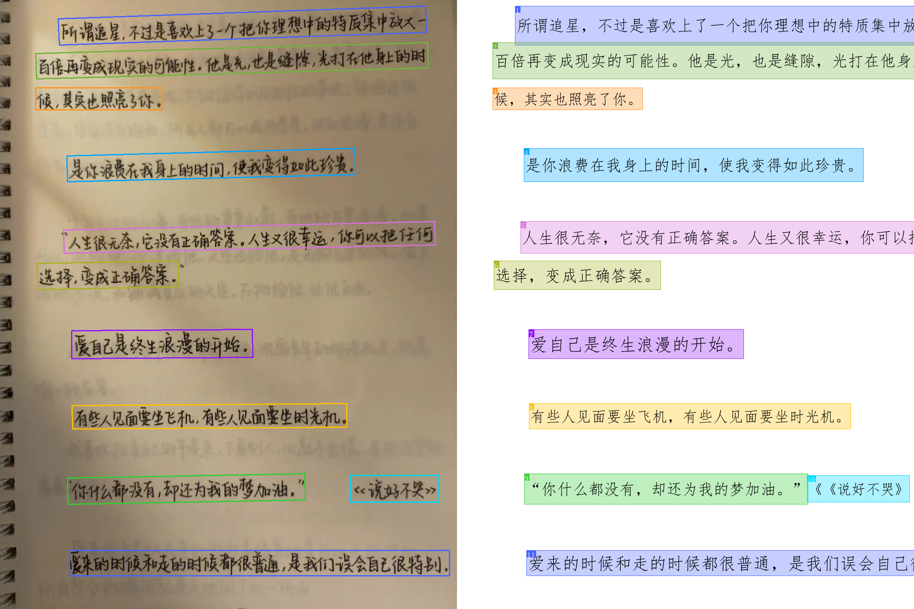

# ComboOCR - Intelligent Text Recognition System
<div align="center">
    
</div>

  

**High-Precision OCR Text Recognition System Based on Deep Learning**

## 📖 Project Overview

ComboOCR is a high-precision OCR text recognition system that integrates multiple advanced deep learning models:

- **PPOCRv5 Fine-tuned Models**: Detection, recognition and text direction classification models based on PPOCRv5
- **Appearance Enhancement Model**: Remove shadows and noise to improve image quality
- **Distortion Correction Model**: Automatically correct document distortion and deformation

## 🚀 Quick Start

### Environment Setup

```bash
pip install -r requirements.txt -i https://pypi.tuna.tsinghua.edu.cn/simple
```

### Distortion Correction and Appearance Enhancement Models

Store both model files `doctr_plus` and `gcdr_net` in the `./models` folder

- **Distortion Correction Model**: Based on [DocTr++](https://github.com/fh2019ustc/DocTr-Plus) implementation, uploaded to [Baidu Netdisk](https://pan.baidu.com/s/1mz_Mqwm9i_b7xfj22yU_7A), extraction code: `68av`
- **Appearance Enhancement Model**: Based on [GCDRNet](https://ieeexplore.ieee.org/abstract/document/10268585/authors#authors) implementation, uploaded to [Baidu Netdisk](https://pan.baidu.com/s/1mz_Mqwm9i_b7xfj22yU_7A), extraction code: `68av`

### Start Service

```bash
python flask_ocr.py
```

Visit `http://localhost:5000` after startup to use the web interface.

## 📡 API Interface

### Image Recognition Endpoint

**Request Parameters**:

| Parameter       | Type    | Required | Description                                        |
| --------------- | ------- | -------- | -------------------------------------------------- |
| image           | file    | Yes      | Image file (supports png/jpg/jpeg/bmp)            |
| use_enhancement | boolean | No       | Enable appearance enhancement (default: false)     |
| use_dewarp      | boolean | No       | Enable distortion correction (default: false)     |

**Request Example**:

```bash
curl -X POST http://localhost:5000/process \
  -F "image=@test.jpg" \
  -F "use_enhancement=true" \
  -F "use_dewarp=true"
```

**Response Example**:

```json
{
  "sorted_text": "Recognized text content",
  "ocr_result": [
    {
      "polygon": [x1, y1, x2, y2, x3, y3, x4, y4],
      "text": "Text content"
    },
    ......
  ],
  "visualization": "Base64 encoded visualization image",
  "processing_info": {
    "use_enhancement": true,
    "use_dewarp": true,
    "text_regions_count": 5
  }
}
```

## 📁 Project Structure

```
ComboOCR/
├── flask_ocr.py           # Main Flask application
├── requirements.txt       # Python dependencies
├── models/                # Model files directory
├── onnxocr/               # OCR related files
├── utils/                 # Utility functions
└── temp_uploads/          # Temporary files directory
```

## 🎨 OCR Results Showcase

### Web Interface Display
<div align="center">
    
</div>

### Demo 1
<div align="center">
    
</div>

### Demo 2
<div align="center">
    
</div>

### Demo 3 (Distortion Correction)
<div align="center">
    
</div>

### Demo 4 (Appearance Enhancement)
<div align="center">
    
</div>

### Demo 5 (Handwriting)
<div align="center">
    
</div>
